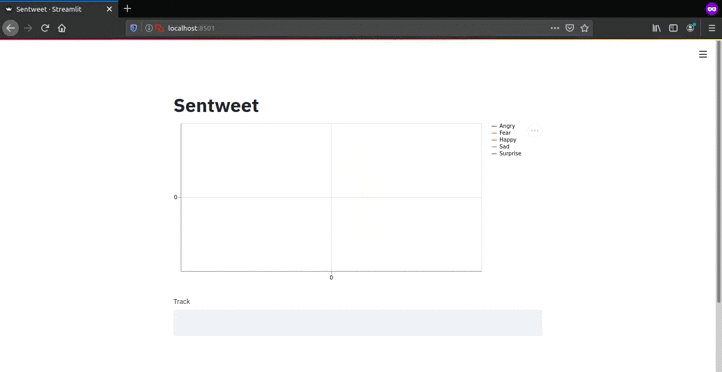

# Sentwit

A modular approach to creating a web-app that determines how twitter users are feeling about a particular keyword.

Enter the keyword in the text box on which you want to track the twitterati sentiments. A live line chart shows you the following emotions:  
**`Anger`, `Fear`, `Happiness`, `Sadness`,** and  **`Surprise`**.
Each emotion is given a score between `0` and `1`.

## Sample

## Acknowledgements
+ Huge shoutout to [@streamlit](https://github.com/streamlit/streamlit) who made it super easy to create and deploy a web application in a matter of minutes!  
+ Also, cannot thank user [@aman2656](https://github.com/aman2656) enough for the [text2emotion-library](https://github.com/aman2656/text2emotion-library). 

## Live Demo
View on [Heroku](https://sentwit.herokuapp.com).
